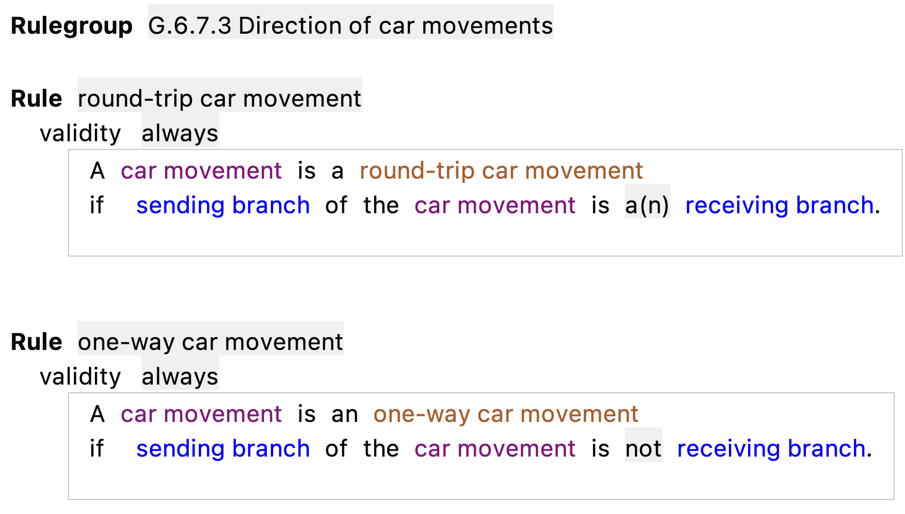

# English Regelspraak

Regelspraak is a controlled natural language (Dutch) and is used by the Dutch tax department to specify their tax calculations (and more).

The Regelspraak language is implemented in ALEF, the Agile law execution factory. ALEF is the tool used by rule analists  to specify rule services for tax calculations, data validations and other legal consequences. ALEF is developed using JetBrains MPS, an open source language workbench from JetBrains.

This project contains a partial translation of the Regelspraak language.  The project is in DRAFT PHASE, NOT FINISHED AND NOT TO BE  USED FOR PRODUCTION PURPOSES. 
## Purpose
The sole purpose of this project is to explain ALEF and Regelspraak to non Dutch speakers. It can be used to demonstratie rules like the one from EU-RENT.

## Compatibility
This project is to be used with ALEF-2022.3
